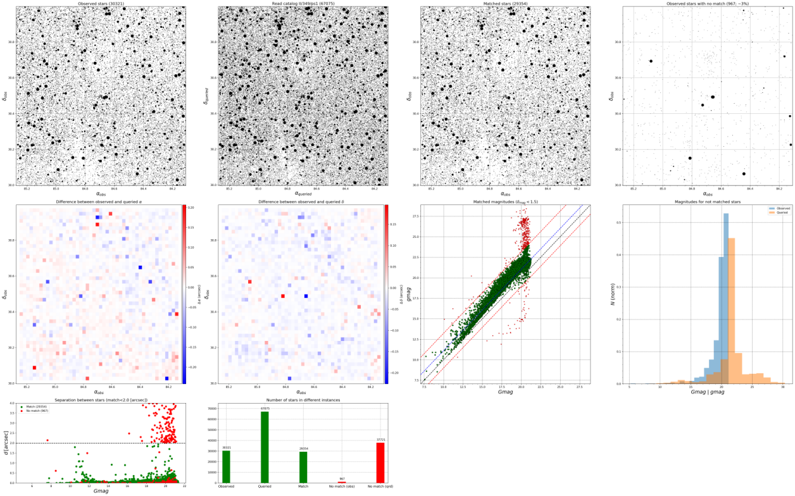

# Catalog Match

Given input `ra, dec` coordinates, uses the [astroquery][1] package to download
the same frame from a selected catalog.

Both catalogs are then matched using astropy's [match_to_catalog_sky][2].

Currently, only `Vizier` catalogs can be queried. To obtain the list of
supported catalogs in `Vizier`, try the following in a Python session (in
this example, I search for GAIA2 data):

    from astroquery.vizier import Vizier
    catalog_list = Vizier.find_catalogs('gaia 2')
    print(Vizier.get_catalogs(catalog_list.keys()))

In this case, the GAIA2 data is in the `I/345` catalog.

## Installation

Requires the `conda` package manager: https://conda.io/miniconda.html

After `conda` is installed,create an environment and install the required
packages with:

    $ conda create -n cat-match matplotlib numpy scipy astropy
    $ conda install -c astropy astroquery

Then activate the environment:

    $ conda activate cat-match

After a succesfull activation, the terminal session should look like:

    (cat-match) $

## Running

After downloading and extracting the repository, rename the
`params_input_def.dat` to `params_input.dat`.

Put a file in the `/input` folder and set the proper parameters in the
`params_input.dat` file.

Run with:

    (cat-match) $ python catalog-match.py

## Output

The code outputs three `.dat` files:

* `cluster_match.dat`: file with the cross-matched stars.
* `cluster_no_match.dat`: file with the stars that could not be cross-matched.
* `cluster_query.dat`: file with the queried catalog data.

and one `.png` file:

* `cluster.png`: figures showing the crossed-matched stars and more.

which looks like this:

[1]: https://astroquery.readthedocs.io
[2]: http://docs.astropy.org/en/stable/coordinates/matchsep.html#matching-catalogs